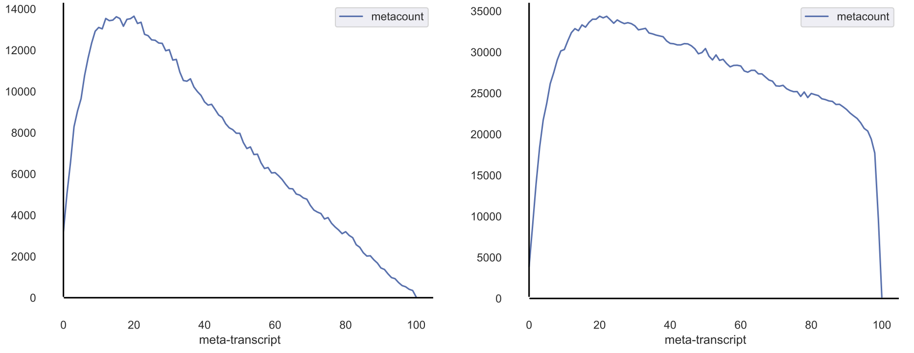

##############################
Quality Control and Analysis
##############################

=================================
Differential Expression Analysis
=================================
| Differential Expression analysis allows one to determine significantly enriched or depleted genes between two conditions.
|
| Assumptions:
|   - R is installed on your machine and is in your $PATH
|   - All input files are tab-delimited (with .txt or .tsv suffix)
|   - Design formula does not include the tilde (~) and there are no spaces
|   - Your base parameter in a given column in the sample_info file must be first alphabetically. If this is not the base, you can append letters to the beginning to force alphabetical order

-----------
Arguments
-----------
| The help menu can be accessed by calling the following from the command line:

.. code-block:: shell

  $ xpresspipe diffxpress --help

.. list-table::
   :widths: 35 50
   :header-rows: 1

   * - Required Arguments
     - Description
   * - :data:`-d \<path/filename.tsv\>, --data \<path/filename.tsv\>`
     - Path and file name of expression counts matrix
   * - :data:`-s \<path/filename.tsv\>, --sample \<path/filename.tsv\>`
     - Path and file name of sample information matrix
   * - :data:`--design \<formula\>`
     - Path to parent organism reference directory

-----------
Examples
-----------
| **Example 1 -- Analyze RNAseq data**

.. ident with TABs
.. code-block:: python

  > data = pd.read_csv('/path/to/expression_counts.tsv', index_col=0)
  > data
                  s1  s2  s3  s4  ...
  ENSG00000227232 66  59  1   82  ...
  ENSG00000240361 35  0   7   72  ...
  ENSG00000238009 20  70  85  78  ...
  ENSG00000241860 96  7   93  38  ...
  ENSG00000187634 73  41  92  77  ...
  > batch = pd.read_csv('/path/to/sample_info.tsv', index_col=0)
  > batch
    Sample  Replicate Condition
  0 s1      rep1      a_WT
  1 s2      rep2      a_WT
  2 s3      rep1      a_WT
  3 s4      rep2      a_WT
  4 s5      rep1      b_EXP
  5 s6      rep2      b_EXP
  6 s7      rep1      b_EXP
  7 s8      rep2      b_EXP

.. code-block:: shell

  $ xpresspipe diffxpress -d test_r/test_dataset.tsv --sample test_r/sample_info.tsv --design Condition

| **Example 2 -- Analyze RNAseq data that was prepared in different batches:**

.. ident with TABs
.. code-block:: python

  > data = pd.read_csv('/path/to/expression_counts.tsv', index_col=0)
  > data
                  s1  s2  s3  s4  ...
  ENSG00000227232 66  59  1   82  ...
  ENSG00000240361 35  0   7   72  ...
  ENSG00000238009 20  70  85  78  ...
  ENSG00000241860 96  7   93  38  ...
  ENSG00000187634 73  41  92  77  ...
  > batch = pd.read_csv('/path/to/sample_info.tsv', index_col=0)
  > batch
    Sample  Replicate Condition Batch
  0 s1      rep1      a_WT      batch1
  1 s2      rep2      a_WT      batch1
  2 s3      rep1      a_WT      batch1
  3 s4      rep2      a_WT      batch1
  4 s5      rep1      b_EXP     batch2
  5 s6      rep2      b_EXP     batch2
  6 s7      rep1      b_EXP     batch2
  7 s8      rep2      b_EXP     batch2

.. code-block:: shell

  $ xpresspipe diffxpress -d test_r/test_dataset.tsv --sample test_r/sample_info.tsv --design Condition+Batch

| **Example 3 -- Analyze ribosome profiling data:**

.. ident with TABs
.. code-block:: python

  > data = pd.read_csv('/path/to/expression_counts.tsv', index_col=0)
  > data
                  s1_fp   s1_rna  s2_fp   s2_rna  ...
  ENSG00000227232 66      59      1       82      ...
  ENSG00000240361 35      0       7       72      ...
  ENSG00000238009 20      70      85      78      ...
  ENSG00000241860 96      7       93      38      ...
  ENSG00000187634 73      41      92      77      ...
  > batch = pd.read_csv('/path/to/sample_info.tsv', index_col=0)
  > batch
    Sample  Replicate Condition Type
  0 s1_fp   rep1      a_WT      RPF
  1 s1_rna  rep1      a_WT      RNA
  2 s2_fp   rep2      a_WT      RPF
  3 s2_rna  rep2      a_WT      RNA
  4 s3_fp   rep1      b_EXP     RPF
  5 s3_rna  rep1      b_EXP     RNA
  6 s4_fp   rep2      b_EXP     RPF
  7 s4_rna  rep2      b_EXP     RNA

.. code-block:: shell

  $ xpresspipe diffxpress -d test_r/test_dataset.tsv --sample test_r/sample_info.tsv --design Type+Condition+Type:Condition

=================================
Read Distribution Analysis
=================================
| When performing RNAseq, your sequencing library population is important to assess to ensure a quality sequencing run. Unexpected populations can be indicative of RNA degradation or other effects. In ribosome profiling, the expected footprint size is ~28-30 nucleotides, so you would expect a peak in this region when running your analysis. The following module will run read distribution analysis for all fastq samples within a given directory. It is recommended this analysis be performed on trimmed reads to clean up adaptors and get the true distribution of sequence reads in the library.

-----------
Arguments
-----------
| The help menu can be accessed by calling the following from the command line:

.. code-block:: shell

  $ xpresspipe readDistribution --help

.. list-table::
   :widths: 35 50
   :header-rows: 1

   * - Required Arguments
     - Description
   * - :data:`-i \<path\>, --input \<path\>`
     - Path to input directory of trimmed fastq (or untrimmed fastq) files
   * - :data:`-o \<path\>, --output \<path\>`
     - Path to output directory
   * - :data:`-e \<experiment_name\>, --experiment \<experiment_name\>`
     - Experiment name

-----------
Examples
-----------
| **Example 1 -- Analyze read distributions from ribosome profiling libraries**

.. ident with TABs
.. code-block:: python

  $ xpresspipe readDistribution -i riboprof_out/trimmed_fastq -o riboprof_out -e se_test

=================================
Metagene Analysis
=================================
| Analyze each sequencing sample to ensure equal distribution of reads across all transcripts. Can be useful in identifying 5' or 3' biases in sequence preparation.

.. code-block:: shell

  $ xpresspipe metagene --help

.. list-table::
   :widths: 35 50
   :header-rows: 1

   * - Required Arguments
     - Description
   * - :data:`-i \<path\>, --input \<path\>`
     - Path to input directory of SAM alignment files
   * - :data:`-o \<path\>, --output \<path\>`
     - Path to output directory
   * - :data:`-r \<path\>, --reference \<path\>`
     - Path to parent organism reference directory
   * - :data:`-t <DEFAULT, CODING, CODING_TRUNCATED>`, :data:`--reference_type <DEFAULT, CODING, CODING_TRUNCATED>`
     - RefFlat type (i.e. "DEFAULT", "CODING", "CODING_TRUNCATED")
   * - :data:`-e \<experiment_name\>, --experiment \<experiment_name\>`
     - Experiment name

-----------
Examples
-----------
| **Example 1 -- Analyze metagene profiles of sequence libraries**
| - Use default transcript reference (maps to all transcripts, even if non-coding)

.. ident with TABs
.. code-block:: python

  $ xpresspipe metagene -i riboprof_out/alignments/ -o riboprof_out -r se_reference -t DEFAULT -e se_test

=================================
Codon Periodicitiy Analysis
=================================
| Analze periodicity of most abundant read length. Useful in ribosome profiling samples for identifying that ribosomes are taking the expected 3 nucleotide steps along a transcript. If this is not apparent from the analysis, it may be indicative of poor sequence coverage of the ribosome profiling libraries.

.. code-block:: shell

  $ xpresspipe periodicity --help

.. list-table::
   :widths: 35 50
   :header-rows: 1

   * - Required Arguments
     - Description
   * - :data:`-i \<path\>, --input \<path\>`
     - Path to input directory of SAM alignment files
   * - :data:`-o \<path\>, --output \<path\>`
     - Path to output directory
   * - :data:`-g \</path/transcripts.gtf\>, --gtf \</path/transcripts.gtf\>`
     - Path and file name to reference GTF for periodicity reference generation/location
   * - :data:`-e \<experiment_name\>, --experiment \<experiment_name\>`
     - Experiment name

.. list-table::
  :widths: 35 50
  :header-rows: 1

  * - Optional Arguments
    - Description
  * - :data:`--landmark \<landmark\>`
    -  Metagene count landmark variable (Plastid-valid) for landmark anchor of periodicity analysis (default: cds_start)
  * - :data:`--downstream \<value\>`
    - Number of nucleotides to track after the landmark (default: 200)
  * - :data:`--generate_ref`
    - Provide flag to generate periodicity reference using GTF file provided

-----------
Examples
-----------
| **Example 1 -- Analyze periodicity from ribosome profiling libraries**

.. ident with TABs
.. code-block:: python

  $ xpresspipe periodicity -i riboprof_out/alignments/ -o riboprof_out -g se_reference/transcripts.gtf -e se_test

