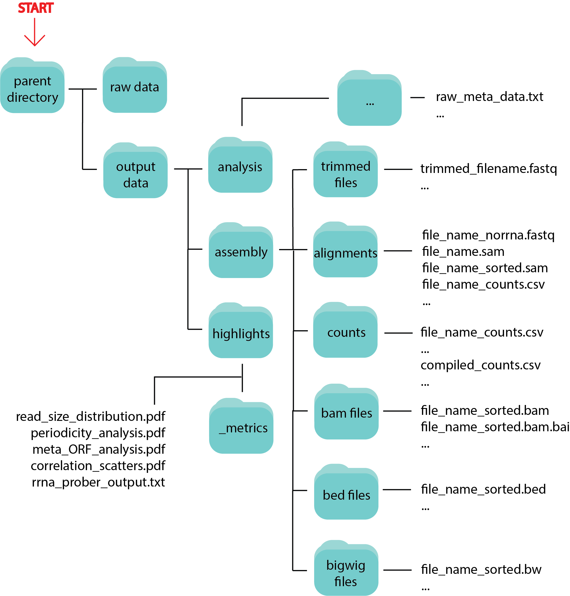

#############
General Usage
#############

The purpose of RiboPipe is to automate the alignment, quality control, and initial analysis of ribosome profiling and other short, single-end read data. It is intended that
input data is a directory of .fastq formatted files. However, when using the intermediate submodules, such as :data:`align` or :data:`quality`, input will vary and is explicated
in the :data:`--help` menu for each submodule.

RiboPipe was created with the novice bioinformatician in mind, and the documentation written assuming no background in using Command Line or programming. As such, instructions
have been created with as much detail as possible. Additionally, `walkthrough videos <>`_ are available. In cases where RiboPipe is being used on a cloud computing cluster, or
Linux machine with Singularity installed, a singularity container image can be used to avoid the installation process. Additionally, alignment references have been created for a
variety of model organisms using current builds to help users avoid this step. Details on how to incorporate a newly created reference not already provided within the RiboPipe
infrastructure can be found `here <advanced-usage.html>`_.

RiboPipe can be run essentially from beginning to end as a pipeline, or as individual submodules. We will describe each option in detail below.

======================================
Important File Naming Conventions
======================================
In order for many of the RiboPipe functions to perform properly and for the output to be reliable after alignment (except for generation of a raw counts table), file naming conventions must be followed.

1)  Download your raw sequence data and place in a folder -- this folder should contain all the sequence data and nothing else.
2)  Make sure files follow a pattern naming scheme. For example, if you had 3 genetic backgrounds of ribosome profiling data, the naming scheme would go as follows:

.. code-block:: shell

  ExperimentName_BackgroundA_FP.fastq(.qz)
  ExperimentName_BackgroundA_RNA.fastq(.qz)
  ExperimentName_BackgroundB_FP.fastq(.qz)
  ExperimentName_BackgroundB_RNA.fastq(.qz)
  ExperimentName_BackgroundC_FP.fastq(.qz)
  ExperimentName_BackgroundC_RNA.fastq(.qz)

3)  If the sample names are replicates, their sample number needs to be indicated.
4)  If you want the final count table to be in a particular order and the samples ordered that way are not alphabetically, append a letter in front of the sample name to force this ordering.

.. code-block:: shell

  ExperimentName_a_WT_FP.fastq(.qz)
  ExperimentName_a_WT_RNA.fastq(.qz)
  ExperimentName_b_exType_FP.fastq(.qz)
  ExperimentName_b_exType_RNA.fastq(.qz)

5)  If you have replicates:

.. code-block:: shell

  ExperimentName_a_WT_1_FP.fastq(.qz)
  ExperimentName_a_WT_1_RNA.fastq(.qz)
  ExperimentName_a_WT_2_FP.fastq(.qz)
  ExperimentName_a_WT_2_RNA.fastq(.qz)
  ExperimentName_b_exType_1_FP.fastq(.qz)
  ExperimentName_b_exType_1_RNA.fastq(.qz)
  ExperimentName_b_exType_2_FP.fastq(.qz)
  ExperimentName_b_exType_2_RNA.fastq(.qz)

6)  If you are just running RNAseq files through the pipeline, you only need the RNA samples in your input directory and specify the rnaseq module:

.. code-block:: shell

  ExperimentName_a_WT_1_RNA.fastq(.qz)
  ExperimentName_a_WT_2_RNA.fastq(.qz)
  ExperimentName_b_exType_1_RNA.fastq(.qz)
  ExperimentName_b_exType_2_RNA.fastq(.qz)

  ribopipe rnaseq -i input_directory ...

======================
:data:`riboseq` module
======================
Pipeline for handling raw ribosome profiling sequence data. Runs quality and adaptor trimming, alignment, quality control, and formatting on a directory of raw ribosome profiling
sequence data.

The :data:`riboseq` module can be run as follows:

.. code-block:: shell

  $ ribopipe riboseq -i $DATA_PATH/raw_ingolia/ -o $DATA_PATH/out_ingolia/ -r yeast -e ingolia_2015 \
                     -s a_WT_DED1_1_15deg b_WT_DED1_2_15deg c_ded1_cs_1_15deg d_ded1_cs_2_15deg \
                     e_WT_DED1_1_37deg f_WT_DED1_2_37deg g_ded1_ts_1_37deg h_ded_ts_2_37deg \
                     i_WT_TIF1_1_30deg j_WT_TIF1_2_30deg k_tif1_ts_1_30deg l_tif1_ts_2_30deg \
                     m_WT_TIF1_1_37deg n_WT_TIF1_2_37deg o_tif1_ts_1_37deg p_tif1_ts_2_37deg \
                     -p HISAT2 -a CTGTAGGCACCATCAAT --platform ILLUMINA --count_cutoff 32

An explanation of the :data:`riboseq` submodule arguments can be found in the following tables:

.. list-table:: :data:`riboseq` required arguments
   :widths: 35 50
   :header-rows: 1

   * - Argument
     - Description
   * - :data:`-i INPUT, --input INPUT`
     - Specify full PATH to input directory
   * - :data:`-o OUTPUT, --output OUTPUT`
     - Specify full PATH to output directory
   * - :data:`-r \<yeast\>, \<human\>, \<mouse\>`, :data:`--reference \<yeast\>, \<human\>, \<mouse\>`
     - Specify model organism used for experiments. Pipeline will align a current, curated reference
   * - :data:`-e \<string\>`, :data:`--experiment \<string\>`
     - Provide experiment name to prepend to output files
   * - :data:`-s \<string\> [\<string\> ...]`, :data:`--samples \<string\> [\<string\> ...]`
     - Space delimited list of samples in order. If replicates are included, indicate number in sample name to delineate.
   * - :data:`-a \<string\> [\<string\> ...]`, :data:`--adaptor \<string\> [\<string\> ...]`
     - Sequence of 3' linker (only supports one 3' linker currently) (default: :data:`AACTGTAGGCACCATCAAT`). If no adaptor was used, specify :data:`None`'

.. list-table:: :data:`riboseq` optional arguments
   :widths: 35 50
   :header-rows: 1

   * - Argument
     - Description
   * - :data:`-m \<int\>, --max_processors \<int\>`
     - Number of max processors pipeline can use for multiprocessing tasks (default: No limit)
   * - :data:`-f, --footprints_only`
     - Select this option if ONLY providing raw footprint sequence data
   * - :data:`--min_overlap \<integer\>`
     - Minimum number of bases that must match on a side to combine sequences for :data:`rrna_prober`
   * - :data:`-p \<HISAT2\>, \<STAR\>`, :data:`--program \<HISAT2\>, \<STAR\>`
     - Alignment software to be used to align reads to reference (default: :data:`STAR`)
   * - :data:`--read_length_min \<int\>`
     - Minimum read length threshold to keep for reads (default: :data:`11`)
   * - :data:`--read_length_max \<int\>`
     - Maximum read length threshold to keep for reads (default: :data:`50`)
   * - :data:`--read_quality \<int\>`
     - PHRED read quality threshold (default: :data:`28`)
   * - :data:`--platform \<SANGER\>, \<ILLUMINA\>`
     - Sequencing platform used (default: :data:`ILLUMINA`)
   * - :data:`--full_genome`
     - Add this option to map reads to full genome. If not given, will not count any read mapping to the first 45 nt of transcripts for ribosome profiling
   * - :data:`--count_cutoff \<int\>`
     - Minimum counts threshold. Will remove any row in the final count tables if any sample does not meet this cutoff threshold

Additional information:
^^^^^^^^^^^^^^^^^^^^^^^
:data:`-s`, :data:`--samples`: For ribosome profiling, do not differentiate between footprint and RNA samples.

:data:`--full_genome`: It is recommended to NOT include this option as ribosome profiling data for this region is often unreliable.

Follow up with the :data:`diffex` submodule for differential expression analysis.

======================
:data:`rnaseq` module
======================
Similar to the :data:`riboseq` module, but tuned for small RNAseq (i.e. anything single-end under 100 bps). It is expected that in the future, RiboPipe will be able to perform
automated paired-end and genome sequencing assembly and alignment.

The :data:`rnaseq` module can be run as follows:

.. code-block:: shell

  $ ribopipe rnaseq -i $DATA_PATH/raw_dang_berger/ -o $DATA_PATH/out_dang_berger/ -r yeast -e dang_berger_2014 \
                    -s WT_NR_A WT_NR_B WT_CR_A WT_CR_B \
                    -p HISAT2 -a TGGAATTCTCGGGTGCCAAGG --platform ILLUMINA --replicates

An explanation of the :data:`riboseq` submodule commands can be found in the following tables:

.. list-table:: :data:`rnaseq` required arguments
   :widths: 35 50
   :header-rows: 1

   * - Argument
     - Description
   * - :data:`-i INPUT, --input INPUT`
     - Specify full PATH to input directory
   * - :data:`-o OUTPUT, --output OUTPUT`
     - Specify full PATH to output directory
   * - :data:`-r \<yeast\>, \<human\>, \<mouse\>`, :data:`--reference \<yeast\>, \<human\>, \<mouse\>`
     - Specify model organism used for experiments. Pipeline will align a current, curated reference
   * - :data:`-e \<string\>`, :data:`--experiment \<string\>`
     - Provide experiment name to prepend to output files
   * - :data:`-s \<string\> [\<string\> ...]`, :data:`--samples \<string\> [\<string\> ...]`
     - Space delimited list of samples in order. If replicates are included, indicate number in sample name to delineate.
   * - :data:`-a \<string\> [\<string\> ...]`, :data:`--adaptor \<string\> [\<string\> ...]`
     - Sequence of 3' linker (only supports one 3' linker currently) (default: :data:`AACTGTAGGCACCATCAAT`). If no adaptor was used, specify :data:`None`'

.. list-table:: :data:`rnaseq` optional arguments
   :widths: 35 50
   :header-rows: 1

   * - Argument
     - Description
   * - :data:`-m \<int\>, --max_processors \<int\>`
     - Number of max processors pipeline can use for multiprocessing tasks (default: No limit)
   * - :data:`--replicates`
     - Select this option if samples are replicates (do not use if 3+ replicates).
   * - :data:`-p \<HISAT2\>, \<STAR\>`, :data:`--program \<HISAT2\>, \<STAR\>`
     - Alignment software to be used to align reads to reference (default: :data:`STAR`)
   * - :data:`--read_length_min \<int\>`
     - Minimum read length threshold to keep for reads (default: :data:`11`)
   * - :data:`--read_length_max \<int\>`
     - Maximum read length threshold to keep for reads (default: :data:`50`)
   * - :data:`--read_quality \<int\>`
     - PHRED read quality threshold (default: :data:`28`)
   * - :data:`--platform \<SANGER\>, \<ILLUMINA\>`
     - Sequencing platform used (default: :data:`ILLUMINA`)
   * - :data:`--full_genome`
     - Add this option to map reads to full genome. If not given, will only map reads to transcripts.
   * - :data:`--count_cutoff \<int\>`
     - Minimum counts threshold. Will remove any row in the final count tables if any sample does not meet this cutoff threshold

Additional information:
^^^^^^^^^^^^^^^^^^^^^^^
:data:`--replicates`: Make sure when passing the argument to list samples these are sorted so replicates are next to each other in this list

Follow up with the :data:`diffex` submodule for differential expression analysis.

======================
:data:`trim` module
======================
Perform only trimming and quality control steps, outputting general read information. Will output trimmed reads ready for alignment.

The :data:`trim` module can be run as follows:

.. code-block:: shell

  $ ribopipe trim -i $DATA_PATH/input_files/ -o $DATA_PATH/output_files/ \
                    -a TGGAATTCTCGGGTGCCAAGG --platform ILLUMINA

An explanation of the :data:`trim` submodule commands can be found in the following tables:

.. list-table:: :data:`trim` required arguments
   :widths: 35 50
   :header-rows: 1

   * - Argument
     - Description
   * - :data:`-i INPUT, --input INPUT`
     - Specify full PATH to input directory
   * - :data:`-o OUTPUT, --output OUTPUT`
     - Specify full PATH to output directory
   * - :data:`-a \<string\> [\<string\> ...]`, :data:`--adaptor \<string\> [\<string\> ...]`
     - Sequence of 3' linker (only supports one 3' linker currently) (default: :data:`AACTGTAGGCACCATCAAT`). If no adaptor was used, specify :data:`None`'

.. list-table:: :data:`trim` optional arguments
   :widths: 35 50
   :header-rows: 1

   * - Argument
     - Description
   * - :data:`-m \<int\>, --max_processors \<int\>`
     - Number of max processors pipeline can use for multiprocessing tasks (default: No limit)
   * - :data:`--read_length_min \<int\>`
     - Minimum read length threshold to keep for reads (default: :data:`11`)
   * - :data:`--read_length_max \<int\>`
     - Maximum read length threshold to keep for reads (default: :data:`50`)
   * - :data:`--read_quality \<int\>`
     - PHRED read quality threshold (default: :data:`28`)
   * - :data:`--platform \<SANGER\>, \<ILLUMINA\>`
     - Sequencing platform used (default: :data:`ILLUMINA`)

======================
:data:`align` module
======================
Perform only alignment of input files -- assumes files have already been trimmed if required. Will output alignment files and genome browser compatible files.

The :data:`align` module can be run as follows:

.. code-block:: shell

  $ ribopipe align -i $DATA_PATH/input_files/ -o $DATA_PATH/output_files/ -r yeast -e align_only_test \
                    -s sample1_FP sample1_RNA sample2_FP sample2_RNA
                    -a TGGAATTCTCGGGTGCCAAGG --platform ILLUMINA

An explanation of the :data:`align` submodule commands can be found in the following tables:

.. list-table:: :data:`align` required arguments
   :widths: 35 50
   :header-rows: 1

   * - Argument
     - Description
   * - :data:`-i INPUT, --input INPUT`
     - Specify full PATH to input directory
   * - :data:`-o OUTPUT, --output OUTPUT`
     - Specify full PATH to output directory
   * - :data:`-r \<yeast\>, \<human\>, \<mouse\>`, :data:`--reference \<yeast\>, \<human\>, \<mouse\>`
     - Specify model organism used for experiments. Pipeline will align a current, curated reference
   * - :data:`-e \<string\>`, :data:`--experiment \<string\>`
     - Provide experiment name to prepend to output files
   * - :data:`-s \<string\> [\<string\> ...]`, :data:`--samples \<string\> [\<string\> ...]`
     - Space delimited list of samples in order. If replicates are included, indicate number in sample name to delineate.
   * - :data:`t \<riboseq\>, \<rnaseq\>`, :data:`--type \<riboseq\>, \<rnaseq\>`
     - Sequencing type -- :data:`riboseq` for ribosome profiling or :data:`rnaseq` for single-end short read sequence data.

.. list-table:: :data:`align` optional arguments
   :widths: 35 50
   :header-rows: 1

   * - Argument
     - Description
   * - :data:`-m \<int\>, --max_processors \<int\>`
     - Number of max processors pipeline can use for multiprocessing tasks (default: No limit)
   * - :data:`-p \<HISAT2\>, \<STAR\>`, :data:`--program \<HISAT2\>, \<STAR\>`
     - Alignment software to be used to align reads to reference (default: :data:`STAR`)
   * - :data:`--full_genome`
     - Add this argument if you wish to align to the full genome. See notes in :data:`riboseq` and :data:`rnaseq` sections above for more information.
   * - :data:`--count_cutoff \<int\>`
     - Minimum counts threshold. Will remove any row in the final count tables if any sample does not meet this cutoff threshold

======================
:data:`quality` module
======================
Takes a table of raw counts generates paired scatter plots.

The :data:`quality` module can be run as follows:

.. code-block:: shell

  $ ribopipe quality -i $DATA_PATH/raw_counts.csv -o $DATA_PATH/output_location/ \
                    -t riboseq

An explanation of the :data:`quality` submodule commands can be found in the following tables:

.. list-table:: :data:`quality` required arguments
   :widths: 35 50
   :header-rows: 1

   * - Argument
     - Description
   * - :data:`-i INPUT, --input INPUT`
     - Input table (must be .csv file) of raw counts
   * - :data:`-o OUTPUT, --output OUTPUT`
     - Specify full PATH to output directory
   * - :data:`-t \<riboseq\>, \<rnaseq\>`, :data:`--type \<riboseq\>, \<rnaseq\>`
     - Sequencing type -- :data:`riboseq` for ribosome profiling or :data:`rnaseq` for single-end short read sequence data.

Additional information:
^^^^^^^^^^^^^^^^^^^^^^^
Table must have samples set as columns and must be ordered as sample1_FP, sample1_RNA, sample2_FP, sample2_RNA, etc. or as sample1_rep1_RNA, sample1_rep2_RNA, sample2_rep1_RNA, sample2_rep2_RNA.

===============================
:data:`rrna_prober` module
===============================
As the bulk of total cellular RNA consists mostly of ribosomal RNA that is often not of interest and crowds out measurement of other RNAs, an rRNA depletion step is commonly performed before
creating a cDNA sequencing library. Several commercial kits are available that can effectively deplete samples of full length rRNAs. However, inherent in ribosome profiling protocols, samples are
treated with an RNase, which degrades full length rRNAs, making them more difficult to deplete before creating the cDNA library. One way to better deplete these rRNA fragments in ribosome profiling
samples is to create biotinylated RNA probes for overrepresented rRNA fragments to extract these fragments (see this `paper <https://www.ncbi.nlm.nih.gov/pubmed/28579404>`_ for a recent discussion).
:data:`rrna_prober` automates the identification of overrepresented species and outputs a table with these sequences ordered by abundance for ease of probe generation. This table is output in stdout
in this module, or as a :data:`.txt` file in the :data:`highlights/` output folder when running the full :data:`riboseq` submodule.

The :data:`rrna_prober` module can be run as follows:

.. code-block:: shell

  $ ribopipe rrna_prober -i $DATA_PATH/sample1.zip $DATA_PATH/sample2.zip ... \
                          -o $DATA_PATH/output_location/

An explanation of the :data:`rrna_prober` submodule commands can be found in the following tables:

.. list-table:: :data:`rrna_prober` required arguments
   :widths: 35 50
   :header-rows: 1

   * - Argument
     - Description
   * - :data:`-i \<string\> [\<string\> ...]`, :data:`--input \<string\> [\<string\> ...]`
     - Space delimited list of zipped files (include full paths to these files)
   * - :data:`-o \<string\>, --output \<string\>`
     - Output file name to write output to

.. list-table:: :data:`rrna_prober` optional arguments
   :widths: 35 50
   :header-rows: 1

   * - :data:`--min_overlap \<integer\>`
     - Minimum number of bases that must match on a side to combine sequences

===============================
:data:`gene_dictionary` module
===============================

===============================
:data:`diffex` module
===============================

===============================
:data:`truncate` module
===============================

===========
Data Output
===========
Running :data:`riboseq` or :data:`rnaseq` will output all intermediate and final data files in a tree structure as seen below:

