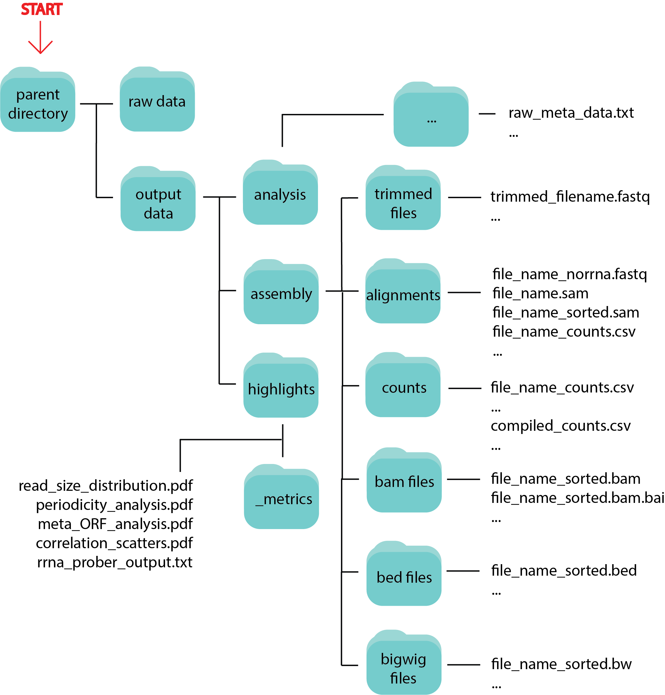

#############
General Usage
#############

| The purpose of XPRESSpipe is to automate the alignment, quality control, and initial analysis of single-end (SE), paired-end (PE), ribosome profiling data. It is intended that input data is a directory of .fastq formatted files. However, when using the intermediate submodules, such as :data:`align` or :data:`readDistribution`, input will vary and is explicated
in the :data:`--help` menu for each submodule.

| XPRESSpipe can be run essentially from beginning to end as a pipeline, or as individual sub-modules. We will describe each option in more detail in each section of the documentation.

| Further analysis on the resulting datasets can be performed using `XPRESStools <https://github.com/XPRESSyourself/XPRESStools>`_.

======================================
File Naming
======================================
| In order for many of the XPRESSpipe functions to perform properly and for the output to be reliable after alignment (except for generation of a raw counts table), file naming conventions must be followed.
| 1. Download your raw sequence data and place in a folder -- this folder should contain all the sequence data and nothing else.
| 2. Make sure files follow a pattern naming scheme. For example, if you had 3 genetic backgrounds of ribosome profiling data, the naming scheme would go as follows:

.. code-block:: shell

  ExperimentName_BackgroundA_FP.fastq(.qz)
  ExperimentName_BackgroundA_RNA.fastq(.qz)
  ExperimentName_BackgroundB_FP.fastq(.qz)
  ExperimentName_BackgroundB_RNA.fastq(.qz)
  ExperimentName_BackgroundC_FP.fastq(.qz)
  ExperimentName_BackgroundC_RNA.fastq(.qz)

| 3. If the sample names are replicates, their sample number needs to be indicated.
| 4. If you want the final count table to be in a particular order and the samples ordered that way are not alphabetically, append a letter in front of the sample name to force this ordering.

.. code-block:: shell

  ExperimentName_a_WT.fastq(.qz)
  ExperimentName_a_WT.fastq(.qz)
  ExperimentName_b_exType.fastq(.qz)
  ExperimentName_b_exType.fastq(.qz)

| 5. If you have replicates:

.. code-block:: shell

  ExperimentName_a_WT_1.fastq(.qz)
  ExperimentName_a_WT_1.fastq(.qz)
  ExperimentName_a_WT_2.fastq(.qz)
  ExperimentName_a_WT_2.fastq(.qz)
  ExperimentName_b_exType_1.fastq(.qz)
  ExperimentName_b_exType_1.fastq(.qz)
  ExperimentName_b_exType_2.fastq(.qz)
  ExperimentName_b_exType_2.fastq(.qz)

===========
Data Output
===========
Running :data:`seRNAseq`, :data:`peRNAseq`, or :data:`riboprof` will output all intermediate and final data files in a tree structure as seen below:

