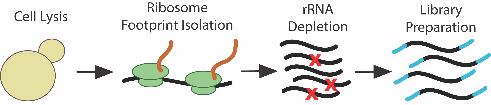

############
Overview
############

==========
Background
==========
`Ribosome profiling <https://en.wikipedia.org/wiki/Ribosome_profiling>`_ utilizes
Next Generation Sequencing to provide a detailed picture of the protein translation
landscape within cells. Cells are lysed, translating ribosomes are isolated, and
the ribosome protected mRNA fragments are integrated into a sequencing library.
The library is then sequenced and raw data (often in the form of
`.fastq <http://support.illumina.com/content/dam/illumina-support/help/BaseSpaceHelp_v2/Content/Vault/Informatics/Sequencing_Analysis/BS/swSEQ_mBS_FASTQFiles.htm>`_
or .txt files) is generated. This pipeline is flexibly designed to be able to
process and perform preliminary analyses on SE (single-end) short (<= 100 bp)
read raw sequence data.

See this `paper <https://www.ncbi.nlm.nih.gov/pubmed/28579404>`_
for a recent discussion and detailed protocol of the technique.

